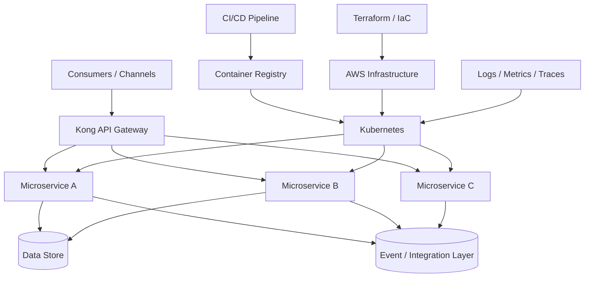
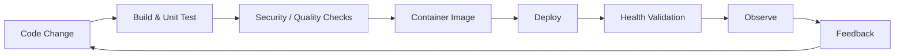

# Cloud-Native Platform Engineering — Sanitized Case Study

**Author:** Robert Matiwa  
**Focus:** AWS, Kubernetes, Terraform, microservices, API gateway, CI/CD, observability, engineering leadership

> Sanitized portfolio case study based on platform-engineering responsibilities from a financial-technology environment. Product names, customer information, infrastructure identifiers and proprietary implementation details are excluded.

## Context

I led a **12-person engineering team** responsible for cloud-native platform and microservice capabilities. The platform used **AWS, Kubernetes, Docker, Terraform and Kong**, with automated delivery pipelines and production observability.

The architecture needed to support rapid service delivery while maintaining reliability, repeatability, security and clear operational ownership.

## Reference architecture

## Architecture principles

### Infrastructure as code

Infrastructure definitions are versioned and reviewed alongside application changes. Terraform provides repeatable environments and reduces configuration drift.

### Independently deployable services

Services own clear capabilities and APIs. Deployment independence reduces coordination overhead, but boundaries are chosen carefully to avoid creating unnecessary distributed-system complexity.

### Gateway-mediated APIs

Kong provides a consistent ingress layer for routing and cross-cutting API concerns. Domain logic remains in services rather than being pushed into gateway configuration.

### Container orchestration

Kubernetes provides standardized deployment, health management, scaling and workload isolation. Applications expose readiness/liveness behaviour appropriate to their dependencies.

### Observability as an architecture requirement

Logs, metrics and traces are designed into services rather than added after production incidents. Correlation identifiers connect API calls and asynchronous flows across service boundaries.

## Delivery model

Engineering governance included design/code reviews, architecture decisions, API standards, delivery-risk management and production-readiness checks.

## Resilience considerations

The platform design treats dependency failure as normal distributed-system behaviour. Patterns include:

- explicit timeouts;
- bounded retries with backoff;
- idempotent operations where duplicate requests are possible;
- health/readiness checks;
- controlled failure propagation;
- asynchronous integration where tight synchronous coupling is unnecessary;
- operational dashboards and alerting;
- documented recovery procedures.

## Security considerations

- authentication and authorization at appropriate API/service boundaries;
- least-privilege workload and infrastructure access;
- encrypted transport;
- secret/configuration separation;
- controlled ingress and egress;
- auditable deployment pipelines;
- security review as part of architecture and delivery governance.

## Leadership dimension

Architecture was not treated as a document handed to engineers. As technical/platform lead, I worked with the 12-person team across design, implementation, reviews, deployment, reliability and production support. This shortened the feedback loop between architecture decisions and real operational behaviour.

## Skills demonstrated

AWS · Kubernetes · Docker · Terraform · Kong · Microservices · REST APIs · CI/CD · Infrastructure as Code · Observability · Resilience · Platform Engineering · Technical Leadership · Architecture Governance
