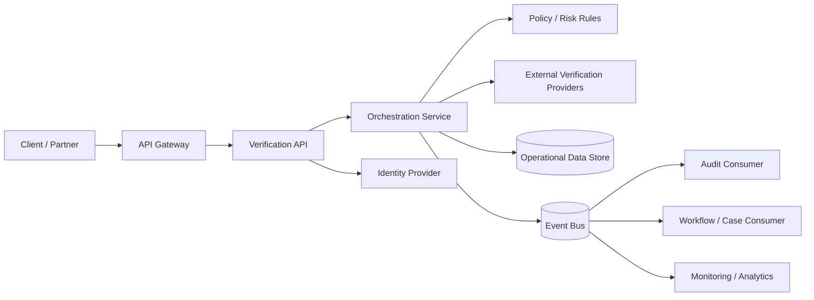

# Regulated Platform Integration Architecture — Portfolio Case Study

**Author:** Robert Matiwa  
**Focus:** Solution architecture, API integration, cloud, security, fraud/compliance controls, technical specification  

> This is a sanitized portfolio sample based on patterns and responsibilities from my work in regulated financial-services and telecom environments. It contains no client-confidential implementation details and does not claim direct ownership of a specific AML/KYC product.

## 1. Business problem

A regulated digital platform needs to onboard and service customers while integrating with multiple external and internal services. The platform must make risk and policy decisions consistently, preserve an auditable record of decisions, protect personally identifiable information, and remain resilient when downstream services are unavailable.

The architecture must support:

- synchronous customer-facing API interactions;
- asynchronous processing for long-running checks;
- external verification and risk-provider integrations;
- policy and fraud/risk decisioning;
- auditable events and immutable decision references;
- secure service-to-service communication;
- controlled retries and idempotency;
- observability, operational support and incident investigation;
- cloud-native deployment and horizontal scaling.

## 2. Architecture drivers

### Functional

1. Accept a verification or risk-assessment request through a versioned REST API.
2. Validate payload structure and mandatory business rules.
3. Create a correlation ID and persist a request record.
4. Invoke one or more external/internal verification services.
5. Apply configurable decision rules.
6. Return an immediate decision when possible, otherwise return a processing state.
7. Publish domain events for audit, downstream workflows and operational monitoring.
8. Expose status and decision-retrieval APIs.

### Non-functional

- **Security:** OAuth 2.0/OIDC, least privilege, encrypted transport and encrypted persistence.
- **Availability:** stateless services, multi-instance deployment and graceful degradation.
- **Resilience:** timeouts, retries with backoff, circuit breakers and dead-letter handling.
- **Auditability:** immutable decision identifiers, correlation IDs and traceable state transitions.
- **Performance:** low-latency synchronous path with asynchronous offloading for slow dependencies.
- **Privacy:** data minimisation, masking in logs and controlled retention.
- **Scalability:** independently scalable API, orchestration and event-processing components.
- **Operability:** metrics, logs, distributed tracing, alerting and health endpoints.

## 3. Proposed logical architecture

## 4. Key solution decisions

### API gateway as the external control point

The API gateway centralises authentication, throttling, request-size controls, version routing and coarse-grained traffic policy. Business rules remain inside the domain service rather than being embedded in gateway configuration.

### Orchestration separated from provider adapters

Provider-specific integration logic is isolated behind adapters. This reduces coupling, allows providers to be replaced independently and prevents external data models from leaking into the core domain.

### Synchronous + asynchronous processing

Fast checks can complete synchronously. Long-running or unreliable dependencies are handled asynchronously through the event bus, allowing the customer-facing API to return a durable processing state instead of holding open connections indefinitely.

### Idempotency by design

Each create request carries or receives an idempotency key. The platform stores the key and original response reference so network retries do not create duplicate assessments or duplicate downstream side effects.

### Decision traceability

Every result is linked to:

- correlation ID;
- request ID;
- decision ID;
- ruleset/version identifier;
- provider reference(s);
- timestamped state transitions.

This allows engineering, operations, audit and risk teams to reconstruct how a decision was reached without exposing sensitive data unnecessarily.

## 5. Example API contract

See [`sample-openapi.yaml`](./sample-openapi.yaml) for a compact API example covering assessment creation and status retrieval.

## 6. Example delivery specification

See [`technical-specification.md`](./technical-specification.md) for the engineering-ready specification derived from the business and compliance drivers above.

## 7. Architecture decision log

See [`decision-log.md`](./decision-log.md) for representative architecture decisions and trade-offs.

## 8. Delivery and governance approach

I would take this through delivery using the following governance checkpoints:

1. confirm business outcomes, risk obligations and data classification;
2. define logical architecture and integration boundaries;
3. agree API contracts and event schemas;
4. document NFRs and measurable acceptance criteria;
5. review threat model and security controls;
6. define observability and support requirements before production;
7. run architecture/design review with engineering and operations;
8. validate resilience, failure-mode and recovery behaviour;
9. record architecture decisions and exceptions;
10. verify production readiness against the agreed controls.

## 9. Relevant experience represented by this sample

This sample reflects the type of work I have performed across regulated banking, telecom and enterprise platform environments: translating business, fraud-risk, security, API-governance and operational requirements into architecture decisions, technical specifications, integration patterns and delivery controls for engineering teams.
