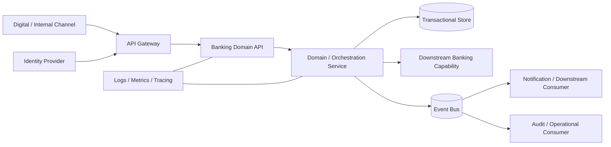

# Regulated Banking Integration Architecture — Sanitized Case Study

**Author:** Robert Matiwa  
**Focus:** Banking, Java/Spring, APIs, cloud, security, reliability, synchronous/asynchronous integration

> Sanitized architecture sample grounded in my regulated banking and financial-platform experience. It demonstrates architecture patterns and specification style without exposing client systems, account data, internal network details or proprietary business rules.

## Context

A banking platform must expose business capabilities to digital channels and internal consumers while integrating reliably with downstream systems. The architecture has to balance customer-facing latency with the stronger auditability, security and failure-management requirements of a regulated environment.

My banking work included secure cloud-oriented solutions using **Java/Spring, APIs, databases and CI/CD**, complemented by later financial-platform experience with distributed services and event-driven integration patterns.

## Logical architecture

## Key design concerns

### Transaction integrity and duplicate prevention

Retries are inevitable when channels, gateways and services communicate across networks. Business operations therefore require a stable request/correlation identifier and idempotent handling so a repeated request does not create an unintended duplicate outcome.

A representative sequence is:

1. validate the request and caller context;
2. check idempotency/request state;
3. execute the domain operation;
4. persist the authoritative result;
5. publish downstream events reliably;
6. return the durable result/reference.

### Synchronous vs asynchronous integration

Customer-facing actions that require an immediate result remain synchronous where the dependency can meet the latency and availability requirement. Notifications, secondary processing and loosely coupled downstream actions are better suited to asynchronous/event-driven integration.

This avoids making every downstream dependency part of the customer's critical path.

### API contract design

Contracts should specify:

- stable resource and operation semantics;
- explicit validation rules;
- consistent error responses;
- correlation/request identifiers;
- authentication/authorization expectations;
- idempotency behaviour;
- versioning strategy;
- measurable latency and availability NFRs.

## Failure-mode specification

| Failure | Expected behaviour |
|---|---|
| Client retries same request | Return/reconcile against the existing idempotent operation |
| Downstream timeout | Apply bounded timeout/retry policy; do not create an uncontrolled duplicate |
| Async consumer unavailable | Retain/retry event and surface operational alerting |
| Invalid authentication | Reject before domain processing |
| Validation failure | Return deterministic client error without downstream side effects |
| Partial processing | Preserve traceable state and support controlled reconciliation |

## Security and compliance controls

- OAuth2/OIDC-style identity and token-based access patterns where appropriate;
- least privilege and separation of duties;
- TLS for service communication;
- encryption for sensitive persisted data;
- masking of sensitive values in logs;
- audit records linked by correlation identifiers;
- controlled deployment through CI/CD;
- production observability and incident traceability;
- retention and access controls aligned to data classification.

## Technology patterns represented

**Java / Spring Boot · REST APIs · AWS · Kubernetes/containers · PostgreSQL/SQL Server · Kafka/Redpanda-style event streaming · CI/CD · OAuth2/OIDC · observability**

The exact product selection is secondary to the architectural concerns: transactional integrity, explicit contracts, secure integration, failure isolation, traceability and operability.

## Architecture trade-offs

### Event-driven integration

**Benefit:** decouples producers from downstream consumers and absorbs temporary consumer outages.  
**Cost:** introduces eventual consistency, replay/ordering considerations and greater operational complexity.

### Microservices

**Benefit:** independent deployment and scaling around clear capabilities.  
**Cost:** network failure modes, distributed tracing, data ownership and operational overhead. A service boundary should therefore be justified by domain and delivery needs rather than created by default.

### Managed cloud services

**Benefit:** reduces undifferentiated infrastructure operations and can improve elasticity/reliability.  
**Cost:** platform coupling, cost-governance requirements and service-specific operational knowledge.

## Skills demonstrated

Banking architecture · Java/Spring · Cloud architecture · API design · Event-driven integration · Idempotency · Security · NFRs · Resilience · CI/CD · Technical specification · Regulated delivery
