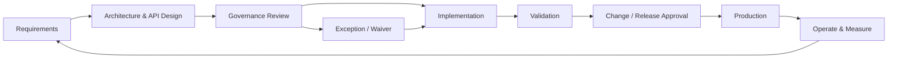

# TM Forum Open API Governance & Standardisation — Sanitized Case Study

**Author:** Robert Matiwa  
**Focus:** Telecom BSS/API architecture, TM Forum Open APIs, lifecycle governance, architecture controls

> Sanitized portfolio case study based on my telecom API-governance work. Client-specific API names, internal structures, configurations and confidential implementation details are intentionally excluded.

## Context

A large telecom environment was standardising a substantial portfolio of enterprise APIs against TM Forum Open API principles. The next delivery wave covered **92 APIs** and required a governance approach that could improve consistency without stopping delivery teams.

The challenge was not simply defining REST standards. Governance needed to connect architecture intent to the full delivery lifecycle: requirements, design, implementation, review, change approval, release and operational ownership.

## Architecture problem

Without explicit lifecycle controls, large API estates commonly develop inconsistent resource models, security approaches, versioning, documentation and exception handling. The objective was therefore to make standards **actionable and governable**, rather than producing a static standards document.

## Governance model

## Key controls

### 1. API design governance

Reviews focus on resource modelling, contract consistency, error semantics, security requirements, versioning, reuse and alignment with the target API landscape.

### 2. Lifecycle checkpoints

Governance is attached to delivery stages so that required artefacts, review evidence and approvals are clear before an API progresses.

### 3. Exception management

A controlled exception path prevents governance from becoming an absolute blocker. Exceptions should document the deviation, rationale, risk, owner and remediation/expiry position.

### 4. Progressive enforcement

A practical adoption model moves from **advisory**, to **warn-and-track**, and finally toward **enforcement** once teams understand the standards and supporting processes are mature.

### 5. Architecture artefacts

Representative artefacts include:

- governance principles;
- API lifecycle map;
- operating model;
- architecture and design-review criteria;
- artefact register;
- stakeholder/RACI mapping;
- exception and risk tracking;
- governance roadmap.

## Platform context

The work operated in an enterprise API-management and change-governance landscape that included **Apigee X** and formal change/CAB processes. The architecture deliberately separates API policy enforcement from broader lifecycle governance: a gateway can enforce runtime policies, but organisational governance also requires ownership, review, evidence, exceptions and decision rights.

## Example engineering acceptance criteria

An API entering implementation should have, at minimum:

- an agreed contract and version;
- authentication/authorization requirements;
- defined error behaviour;
- NFRs and operational expectations;
- identified upstream/downstream dependencies;
- traceable design decisions;
- an owner and lifecycle status;
- documented exceptions where applicable.

## Outcome represented by this case study

The work established a structured governance approach for the **92-API next wave**, translating TM Forum/API standardisation objectives into lifecycle controls, architecture artefacts, reviews and an operating model that engineering and governance stakeholders could apply.

## Skills demonstrated

TM Forum Open APIs · Telecom/BSS architecture · API governance · REST · Apigee X · Architecture review · Lifecycle governance · Operating models · Stakeholder alignment · Technical specifications · Change governance
